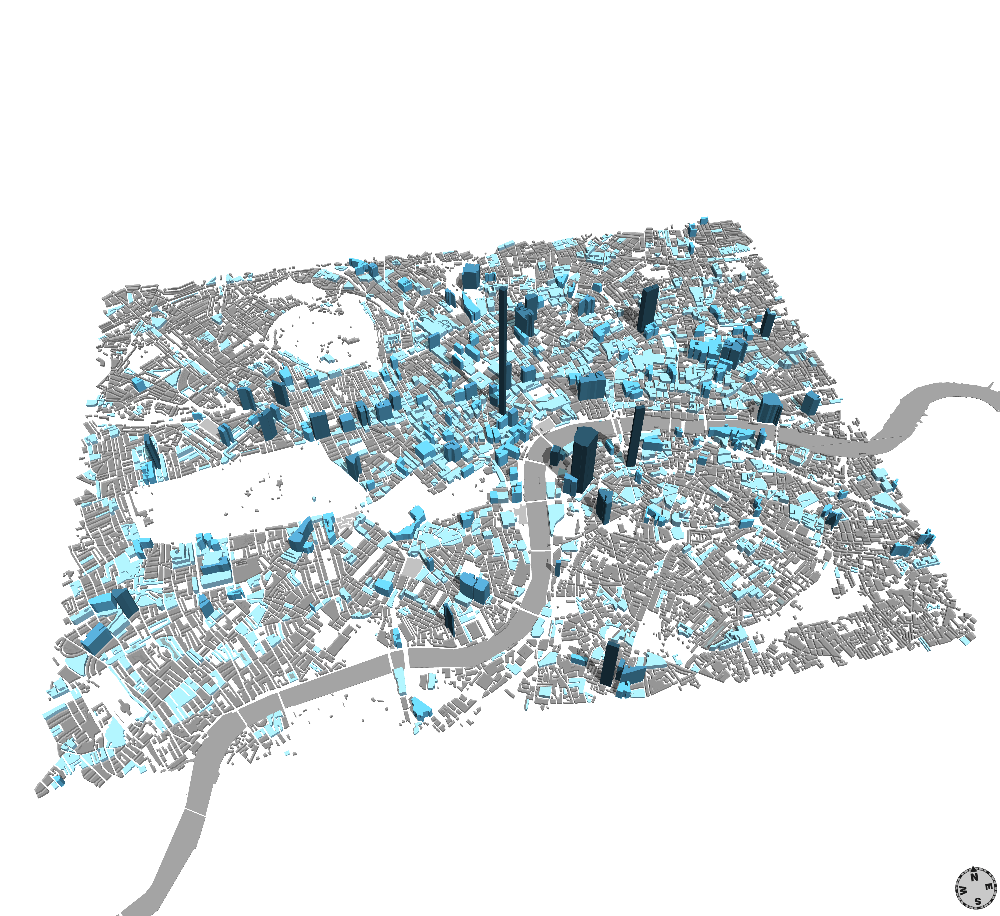
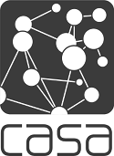

[](https://doi.org/10.5281/zenodo.9795)

# Mapping London Buildings in Real Time using Twitter Data



Esri's [CityEngine](http://www.esri.com/software/cityengine) is a 3D GIS tool which allows city models to be generated procedurally (that is, models are generated using a set of rules). This approach allows us to define simple conditions which govern the appearance of a city model.

Twitter provides a 'firehose' of real-time tweets, including their location if this functionality has been enabled by a user.

Using CityEngine's Python scripting functionality, we've created a model of London in which buildings grow upwards, according to the frequency of tweets which are sent from (or in close proximity to) them.

## Details
### Installation ###
This script requires the [Tweepy](http://tweepy.github.io) library. You should first install the [pip](http://www.pip-installer.org/en/latest/) tool for your Python installation. Because CityEngine uses its own Jython installation, it's easiest to install Tweepy into a specific target directory external to that installation:  
`mkdir /path/to/directory`  
`pip install -t /path/to/directory tweepy`  
This directory should be added to your Python path using `sys.path.append("C:/path/to/directory")` **before** you import tweepy in your script. See our example [here](cityengine_twitter.py#L14-15).

### The CityEngine Ruleset ###

You may use any spatial basemap you like. In this script, the co-ordinates cover the area of wider London, however, they can be altered by the user in the script.

In order to run the demo:

1. Import shapefile `tileslondon.shp`, `cityengine_twitter.py` and `samplerulefile.cga` in CityEngine
2. Assign the rule file `samplerulefile.cga` in `tileslondon`, in case it is not assigned already
3. Run Python script

If you wish to use your own basemap, the steps are as follows:  

1.  Import the shapefile (or any format supported by CityEngine, such as `dxf` &c.), `cityengine_twitter.py` and `samplerulefile.cga` into CityEngine (The script is created for the area of London, so make sure the coordinate system is “British National Grid”). If you are visualising a city outside the UK, this is not necessary, but you will also have to modify the Python script to skip the conversion step to BNG in the [on_status](cityengine_twitter.py#L178) method
2. In the CityEngine scene, select the shapes to which you wish to apply the visualisation, and change the name to `buildings_tq_small` (this corresponds to the variable value [here](cityengine_twitter.py#L22))
3.  Assign the rule file `samplerulefile.cga` to the CityEngine layer in which you wish to collect the tweets. In the rule options of the inspector use `Lot` as Start Rule. You must be able to see three attributes under `samplerulefile`:
    1. `HGT` (controls the height of shapes (object defined))
    2. `Opacityshape` (controls the opacity of the shapes without tweets (user controlled)),
    3. `Opacitytwit` (controls the opacity of the shapes with tweets (user controlled)).
4. Under the field **Object Attributes** in the inspector, right click and add Object Attribute.
You will have to repeat this process 5 times as explained below to add 5 different attributes which will allow you to control the catchment areas for the tweets and the height visualization (the names must be identical): 
    1. Add Object Attribute
        - Attribute name: `HGT` 
        - Type: float 
        - Value: 0 - (adds height to shape) - script controlled
    2. Add Object Attribute
        - Attribute name: `count_t` 
        - Type: float
        - Value: 0 – (this counts the no. of total tweets on each shape) – script controlled
    3. Add Object Attribute
        - Attribute name: `maxHGT`
        - Type: float
        - Value: user defined – (maximum height of the generated shapes)
    4. Add Object Attribute
        - Attribute name: `twitHGT`
        - Type: float
        - Value: user defined – (original step growth per tweet)
    5. Add Object Attribute
        - Attribute name: `maxdistance`
        - Type: float
        - Value: user defined – (defines the maximum catchment area for the tweet (e.g. The maximum radius that one of our shapes may cover)
5. Back on the Rule Attributes, go to `HGT`, select source for attribute `HGT`, and set it to the Object attribute with the name `HGT`. 
6.  Run Python script
7.  If you wish to restart the visualisation – resetting all building heights to zero, you must select all the shapes and in the CityEngine inspector's object attributes, set the `HGT` and `count_t` variables to `0`

### Method ###
Using Tweepy, we have defined a bounding box around Greater London. When a tweet is sent to our script by the Twitter streaming API, we determine whether it contains GPS data, and discard it if not.

The basemap we're using is a map of London building footprints, which is supplied by Ordnance Survey, and which can be obtained from [Digimap](http://digimap.edina.ac.uk/digimap/home). In order to place a tweet on our map, we must first convert its coordinates from [WGS](http://en.wikipedia.org/wiki/WGS84) latitude and longitude points to [Ordnance Survey National Grid coordinates](http://en.wikipedia.org/wiki/British_National_Grid).

Following the conversion we determine whether the tweet falls within the boundary of a building on our basemap. This calculation is performed in two steps:

1. We create a list of the coordinates of the centroid of each object (in this case, shape) on our map. We then calculate which shapes fall within a user-defined radius (in this case, 100 metres)
2. For each shape obtained in step 1, we create a list of the `x` and `y` coordinates of its vertices, and apply the [even-odd](http://en.wikipedia.org/wiki/Even–odd_rule) rule to determine whether the point falls within the surface defined by the vertices. If it does, we extrude the shape by a given factor, set its colour, and define certain characteristics. In our case, we are mapping one particular attribute – location – to the shape in the form of height. However, any attribute of the tweet could be used to alter a shape's attributes. For instance, we could set the heights of the buildings to their true heights, but add a window to the buildings each time a tweet is received

Because we're mapping tweet frequency to building height, we have had to implement a method of slowing the growth of building heights, in order to avoid quickly growing locations which generate a lot of tweets (e.g. the British Museum):  
  
This equation scales the shape's height,`h`, by an amount which decreases linearly as it grows towards the maximum height.
An example generator which yields these values:

``` python
def height():
    """
    Yield linearly-decreasing values, beginning with 100

    """
    maxheight = 18000.00
    previous = 0.00
    while True:
        newheight = previous + (((maxheight - previous) / maxheight) * 100.00)
        previous = newheight
        yield newheight

scaled_height = height()
for h in xrange(5):
    print(scaled_height.next())
    # 100.00, 199.44, 298.33, 396.67, 494.47
```

## Problems and Caveats

- As [Ed Manley](http://urbanmovements.co.uk) and [James Cheshire](http://spatial.ly) have pointed out, different Twitter clients report their location with differing levels of spatial precision, and some clients introduce a rounding error in their reported GPS co-ordinates, which leads to 'striping' when they are visualised. In addition, it is not possible to determine whether a tweet was sent from a moving vehicle or train, or simply as someone was walking close to a building. Additional uncertainty is introduced by the conversion from WGS to BNG, which is only accurate to ~5m
- The Twitter Streaming API only delivers filtered (in our case, by location) messages up to the "streaming cap", and there is no way of determining whether the sample that we receive is "representative"
- Current estimates suggest that only [~1% of Tweets](http://www.quora.com/What-percentage-of-tweets-are-geotagged-What-percentage-of-geotagged-tweets-are-ascribed-to-a-venue#) are Geotagged. Visualising these data thus cannot represent 'actual' Twitter usage in a given place

## Citation

If you make use of this work, please cite it using the following DOI:  
[](https://doi.org/10.5281/zenodo.9795)


---
[](http://www.bartlett.ucl.ac.uk/casa)
